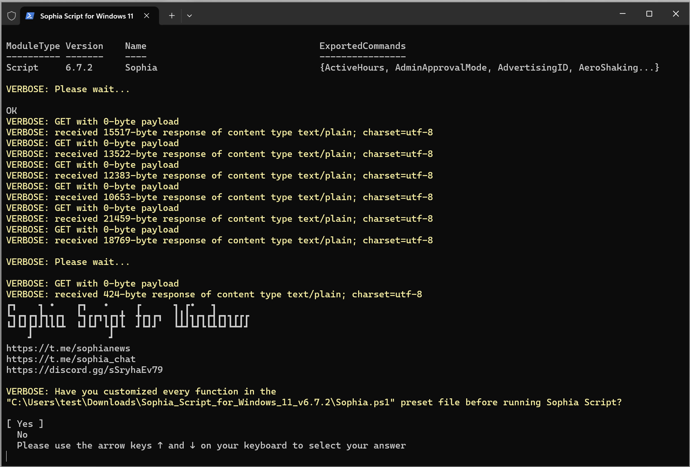

<div align="center">


# Sophia Script for Windows

**Sophia Script for Windows це найпотужніший PowerShell-модуль для тонкого налаштування Windows**

[downloads-badge]: https://img.shields.io/endpoint?url=https://gist.githubusercontent.com/farag2/25ddc72387f298503b752ad5b8d16eed/raw/SophiaScriptDownloadsCount.json
[lines-badge]: https://img.shields.io/endpoint?url=https://gist.githubusercontent.com/farag2/9852d6b9569a91bf69ceba8a94cc97f4/raw/SophiaScript.json
[lines-link]: https://github.com/farag2/Sophia-Script-for-Windows/blob/master/.github/workflows/Badge_lines.yml
[badge-code]: https://github.com/farag2/Sophia-Script-for-Windows/blob/master/.github/workflows/Badge_downloads.yml

[![downloads][downloads-badge]][badge-code]
[![lines][lines-badge]][lines-link]

[telegram-news-badge]: https://img.shields.io/badge/Sophia%20News-Telegram-blue?style=flat&logo=Telegram
[telegram-news]: https://t.me/sophianews
[telegram-group]: https://t.me/sophia_chat
[telegram-group-badge]: https://img.shields.io/endpoint?color=neon&label=Sophia%20Chat&style=flat&url=https%3A%2F%2Ftg.sumanjay.workers.dev%2Fsophia_chat
[discord-news-badge]: https://discordapp.com/api/guilds/1006179075263561779/widget.png?style=shield
[discord-link]: https://discord.gg/sSryhaEv79

[![Telegram][telegram-news-badge]][telegram-news]
[![Telegram][telegram-group-badge]][telegram-group]
[![Discord][discord-news-badge]][discord-link]

[](https://github.com/farag2/Sophia-Script-for-Windows/actions)
[](https://github.com/farag2/Sophia-Script-for-Windows/releases/latest)

[](../README.md)
[](./README_de-de.md)
[](./README_ru-ru.md)



</div>

## Про Sophia Script

`Sophia Script для Windows` - найбільший модуль PowerShell на `GitHub` для тонкого налаштування і автоматизації рутинних завдань в `Windows 10` і `Windows 11`. Він пропонує сучасні UI/UX, більше 150 різних функцій і показує, як можна налаштувати Windows, не ламаючи функціонал.

Зроблено з  до Windows.

> [!IMPORTANT]
> Кожна зміна у файлі налаштувань має відповідну функцію для відновлення налаштувань за замовчуванням. Запускати скрипт найкраще на свіжій установці, оскільки запуск на неправильно налаштованій системі може призвести до виникнення помилок.

> [!WARNING]
> Запуск додатку можливий лише якщо в системі присутній один користувач з правами адміністратора;
>
> `Sophia Script для Windows` може не працювати на "самопальних" збірках Windows. Особливо, якщо збірка була створена так, що в ній спеціально було зламано Microsoft Defender і вимкнено телеметрію, вирізавши системні компоненти.

## Зміст

* [Як завантажити](#як-завантажити)
  * [Завантажити через PowerShell](#завантажити-через-powershell)
  * [Завантажити через Chocolatey](#завантажити-через-chocolatey)
  * [Завантажити через WinGet](#завантажити-через-winget)
  * [Зі сторінки релізу](#зі-сторінки-релізу)
* [Як використовувати](#як-використовувати)
  * [Як запустити певну функцію(ї)](#як-запустити-певну-функціюї)
  * [Wrapper](#wrapper)
  * [Як відкотити зміни](#як-відкотити-зміни)
* [Пожертвування](#пожертвування)
* [Системні вимоги](#системні-вимоги)
* [Ключові особливості](#ключові-особливості)
* [Скріншоти](#скріншоти)
* [Відео](#відео)
* [Як перекласти](#як-перекласти)
* [Медіа](#медіа)
* [SophiApp 2](#sophiapp-2-c--winui-3)

## Як завантажити

### Завантажити через PowerShell

Команда завантажить і розпакує останній архів Sophia Script (`без запуску`) відповідно до того, під якою версією Windows і PowerShell він запускається. Якщо запустити її, наприклад, в Windows 11 через PowerShell 5.1, вона завантажить Sophia Script для `Windows 11 PowerShell 5.1`.

```powershell
iwr script.sophia.team -useb | iex
```

Команда скачає і розпакує останню версію архіву Sophia Script (`без запуску`) з останнього доступного комміту згідно з тими версіями Windows і PowerShell, на яких вона запускалася.

```powershell
iwr sl.sophia.team -useb | iex
```

### Завантажити через Chocolatey

TКоманда завантажить і розпакує останню версію архіву Sophia Script (`без подальшого запуску`) згідно з версією Windows, на якій вона запускалася. Припустимо, якщо ви запустите її на Windows 11, то завантажиться Sophia Script для `Windows 11`. За замовчуванням для `PowerShell 5.1`, якщо не вказано зворотне.

```powershell
choco install sophia --force -y
```

Завантажити `Sophia Script for Windows` для `PowerShell 7`.

```powershell
choco install sophia --params "/PS7" --force -y
```

```powershell
# Видалити Sophia Script
# Видаліть завантажену папку вручну
choco uninstall sophia --force -y
```

### Завантажити через WinGet

Команда скачивает только архив для `Windows 11 (PowerShell 5.1)` в вашу папку `Загрузки` (по сравнению со [скриптом](#завантажити-через-winget) для `Chocolatey`) и распаковывает его.

```powershell
$DownloadsFolder = Get-ItemPropertyValue -Path "HKCU:\Software\Microsoft\Windows\CurrentVersion\Explorer\User Shell Folders" -Name "{374DE290-123F-4565-9164-39C4925E467B}"
winget install --id TeamSophia.SophiaScript --location $DownloadsFolder --accept-source-agreements --force
```

```powershell
# Видалити Sophia Script
winget uninstall --id TeamSophia.SophiaScript --force
```

### Зі сторінки релізу

Скачайте [архів](https://github.com/farag2/Sophia-Script-for-Windows/releases/latest) згідно з версіями вашої Windows і PowerShell.

## Як використовувати

* Завантажте та розархівуйте архів;
* Розпакуйте архів;
* Перегляньте файл `Sophia.ps1` для налаштування функцій, які потрібно запустити;
  * Помістіть символ `#` перед функцією, якщо ви не бажаєте, щоб вона виконувалась.
  * Приберіть символ `#` перед функцією, якщо ви бажаєте, щоб вона виконувалась.
* Скопіюйте весь шлях до `Sophia.ps1`
  * У `Windows 10` натисніть і утримуйте клавішу <kbd>Shift</kbd>, клацніть правою кнопкою миші на `Sophia.ps1` і виберіть Копіювати як шлях;
  * У `Windows 11` клацніть правою кнопкою миші на `Sophia.ps1` і виберіть `Копіювати як шлях`.
* Відкрийте `Windows PowerShell`
  * У `Windows 10` натисніть `Файл` у Провіднику файлів, наведіть курсор на `Відкрити Windows PowerShell` і виберіть `Відкрити Windows PowerShell від імені адміністратора` [(покрокова інструкція зі скріншотами)](https://www.howtogeek.com/662611/9-ways-to-open-powershell-in-windows-10/);
  * У `Windows 11` натисніть правою кнопкою миші на іконку <kbd>Windows</kbd> і відкрийте `Термінал Windows (Адміністратор)`.
* Встановіть політику виконання, щоб мати змогу запускати сценарії лише у поточному сеансі PowerShell;

```powershell
  Set-ExecutionPolicy -ExecutionPolicy Bypass -Scope Process -Force
```

* Введіть `.\Sophia.ps1` і натисніть <kbd>Enter</kbd>;

```powershell
  .\Sophia.ps1
```

### Windows 11

<https://github.com/user-attachments/assets/2654b005-9577-4e56-ac9e-501d3e8a18bd>

### Windows 10

<https://github.com/user-attachments/assets/f5bda68f-9509-41dc-b3b1-1518aeaee36f>

### Як запустити певну функцію(ї)

* Повторіть усі кроки з розділу [Як використовувати](#як-використовувати) і зупиніться на кроці встановлення політики виконання скриптів у `PowerShell`;
* Для запуску певної функції(й) [запустити](https://learn.microsoft.com/en-us/powershell/module/microsoft.powershell.core/about/about_operators#dot-sourcing-operator-) необхідно запустити файл `Import-TabCompletion.ps1`:

```powershell
# З крапкою на початку
. .\Import-TabCompletion.ps1
```

* Тепер можна зробити так (лапки обов'язкові)

```powershell
Sophia -Functions<TAB>
Sophia -Functions temp<TAB>
Sophia -Functions unin<TAB>
Sophia -Functions uwp<TAB>
Sophia -Functions "DiagTrackService -Disable", "DiagnosticDataLevel -Minimal", UninstallUWPApps

UninstallUWPApps, "PinToStart -UnpinAll"
```

Або використовуйте формат старого зразка без автозаповнення функцій <kbd>TAB</kbd> (лапки обов'язкові)

```powershell
.\Sophia.ps1 -Functions CreateRestorePoint, "ScheduledTasks -Disable", "WindowsCapabilities -Uninstall"
```

<https://github.com/user-attachments/assets/ea90122a-bdb3-4687-bf8b-9b6e7af46826>

## Wrapper


@BenchTweakGaming

* Завантажте [останню](https://github.com/farag2/Sophia-Script-for-Windows/releases/latest) версію Wrapper
* Завантажте та розпакуйте архів;
* Запустіть `SophiaScriptWrapper.exe` та імпортуйте `Sophia.ps1`;
  * `Sophia.ps1` повинен знаходитись у тій папці `Sophia Script`;
  * Wrapper має рендеринг інтерфейсу в реальному часі
* Налаштуйте кожну функцію;
* Відкрийте вкладку `Console Output` і натисніть `Run PowerShell`.

## Як відкотити зміни

* Повторіть усі кроки з розділу [Як використовувати](#як-використовувати) і зупиніться на кроці встановлення політики виконання скриптів у `PowerShell`;
* Для запуску певної функції(й) [запустити](https://learn.microsoft.com/en-us/powershell/module/microsoft.powershell.core/about/about_operators#dot-sourcing-operator-) необхідно запустити файл `Import-TabCompletion.ps1`:

```powershell
# З крапкою на початку
. .\Import-TabCompletion.ps1
```

* Викличте функції з пресета `Sophia.ps1`, які ви хочете відкотити.

```powershell
Sophia -Functions "DiagTrackService -Enable", UninstallUWPApps
```

## Пожертвування

[](https://ko-fi.com/farag)

## Системні вимоги

[Windows-10]: https://support.microsoft.com/topic/windows-10-update-history-8127c2c6-6edf-4fdf-8b9f-0f7be1ef3562
[Windows-10-LTSC-2019]: https://support.microsoft.com/topic/windows-10-and-windows-server-2019-update-history-725fc2e1-4443-6831-a5ca-51ff5cbcb059
[Windows-10-LTSC-2021]: https://support.microsoft.com/topic/windows-10-update-history-857b8ccb-71e4-49e5-b3f6-7073197d98fb
[Windows-11-LTSC-2024]: https://support.microsoft.com/topic/windows-11-version-24h2-update-history-0929c747-1815-4543-8461-0160d16f15e5
[Windows-11-24h2]: https://support.microsoft.com/topic/windows-11-version-24h2-update-history-0929c747-1815-4543-8461-0160d16f15e5

|                Версія                    |              Збіркa                   |       Видання       |
|:----------------------------------------:|:-------------------------------------:|:-------------------:|
| Windows 11 24H2                          | [Latest stable][Windows-11-24h2]      | Home/Pro/Enterprise |
| Windows 10 x64 22H2                      | [Latest stable][Windows-10]           | Home/Pro/Enterprise |
| Windows 11 Enterprise LTSC 2024          | [Latest stable][Windows-11-LTSC-2024] | Enterprise          |
| Windows 10 x64 21H2 Enterprise LTSC 2021 | [Latest stable][Windows-10-LTSC-2021] | Enterprise          |
| Windows 10 x64 1809 Enterprise LTSC 2019 | [Latest stable][Windows-10-LTSC-2019] | Enterprise          |

## Ключові особливості

* Усі архіви з використанням GitHub Actions [автоматично](https://github.com/farag2/Sophia-Script-for-Windows/actions);
* Налаштування конфіденційності і телеметрії;
* Активація DNS-over-HTTPS для IPv4;
* Вимкнення запланованих завдань з відстеження зі спливаючою формою, написаною на [WPF](#скріншоти);
* Налаштування інтерфейсу і персоналізація;
* "Правильне" видалення OneDrive;
* Інтерактивні [підказки](#програмна-зміна-розташування-папок-користувача-за-допомогою-інтерактивного-меню);
* <kbd>TAB</kbd> [доповнення](#автодоповнення-tab-детальніше-тут) для функцій та їх аргументів (якщо використовується файл Import-TabCompletion.ps1);
* Зміна розташування користувацьких папок програмно (без переміщення користувацьких файлів) в інтерактивному меню за допомогою стрілок для вибору диска
  * Робочий стіл
  * Документи
  * Завантаження
  * Музика
  * Зображення
  * Відео
* Встановлення безкоштовних (світлий та темний) курсорів "Windows 11 Cursors Concept v2" від [Jepri Creations](https://www.deviantart.com/jepricreations/art/Windows-11-Cursors-Concept-v2-886489356) на льоту;
* Видалення UWP-додатків, що відображають назви пакетів;
  * Скрипт генерує список встановлених UWP-додатків [динамічно](#локалізовані-назви-uwp-пакетів).
* Вимкнення функцій Windows для відображення дружніх назв пакетів у спливаючій формі, написаній на [WPF](#скріншоти);
* Видалення можливостей Windows відображати дружні назви пакетів у спливаючій формі, написаній на [WPF](#скріншоти);
* Завантаження та встановлення [HEVC Video Extensions від виробника пристрою](https://apps.microsoft.com/detail/9N4WGH0Z6VHQ) для відкриття формата [HEVC](https://uk.wikipedia.org/wiki/H.265);
* Реєстрація програми, розрахунок хешу та встановлення за замовчуванням для певного розширення без спливаючого вікна "Як ви хочете відкрити це" за допомогою спеціальної [функції](https://github.com/DanysysTeam/PS-SFTA);
* Експортувати всі асоціації в Windows у корінь папки у вигляді файлу Application_Associations.json;
Імпортувати всі асоціації в Windows з файлу Application_Associations.json. Вам необхідно встановити всі програми згідно з експортованим файлом Application_Associations.json, щоб відновити всі асоціації;
* Встановлення будь-якого підтримуваного дистрибутива Linux для WSL з відображенням дружніх назв дистрибутивів у спливаючій формі, написаній на [WPF](#скріншоти);
  * Створити завдання з нативним тостовим повідомленням, де ви зможете запустити або скасувати [виконання](#інтерактивні-тости-для-запланованих-завдань) завдання.
  * Створити завдання `Windows Cleanup` и `Windows Cleanup Notification` для очищення Windows від невикористовуваних файлів та оновлень;
  * Створити завдання `SoftwareDistribution` для очищення `%SystemRoot%\SoftwareDistribution\Download`;
  * Створити завдання `Temp` для очищення `%TEMP%`.
* Встановити останню версію розповсюджуваних пакетів Microsoft Visual C++ 2015–2022 x86/x64;
* Встановити останню версію розповсюджуваних пакетів .NET Desktop Runtime 8, 9 x86/x64;
* Налаштування безпеки Windows;
* Відобразити всі ключі політик реєстру в оснащенні редагування групових політик (gpedit.msc).
* Ще багато "глибоких" налаштувань Файлового Провідника та контекстного меню.

## Скріншоти

### Автодоповнення <kbd>TAB</kbd>. Детальніше [тут](#як-запустити-певну-функціюї)

https://user-images.githubusercontent.com/10544660/225270281-908abad1-d125-4cae-a19b-2cf80d5d2751.mp4

### Програмна зміна розташування папок користувача за допомогою інтерактивного меню

https://user-images.githubusercontent.com/10544660/253818031-b7ce6bf1-d968-41ea-a5c0-27f6845de402.mp4

### Локалізовані назви UWP-пакетів

 

### Локалізовані назви функцій Windows

 

### Завантажте та встановіть будь-який підтримуваний дистрибутив Linux в автоматичному режимі


### Інтерактивні тости для запланованих завдань


## Відео

[](https://www.youtube.com/watch?v=q_weQifFM58)

[](https://youtu.be/8E6OT_QcHaU?t=370) [](https://youtu.be/091SOihvx0k?t=490)

## Як перекласти

* Дізнайтеся мову інтерфейсу Вашої ОС, викликавши `$PSUICulture` в PowerShell;
* Створіть папку з назвою Вашої мови інтерфейсу;
* Помістіть ваш локалізований файл SophiaScript.psd1 в цю папку.

## Медіа

* [XDA](https://www.xda-developers.com/sophia-script-returns-control-windows-11)
* [4sysops](https://4sysops.com/archives/windows-10-sophia-script-powershell-functions-for-windows-10-fine-tuning-and-automating-routine-configuration-tasks/)
* [gHacks](https://www.ghacks.net/2020/09/27/windows-10-setup-script-has-a-new-name-and-is-now-easier-to-use/)
* [Neowin](https://www.neowin.net/news/this-windows-10-setup-script-lets-you-fine-tune-around-150-functions-for-new-installs)
* [Comss.ru](https://www.comss.ru/page.php?id=8019)
* [Habr](https://habr.com/company/skillfactory/blog/553800)
* [Deskmodder.de](https://www.deskmodder.de/blog/2021/08/07/sophia-script-for-windows-jetzt-fuer-windows-11-und-10/)
* [PCsoleil Informatique](https://www.pcsoleil.fr/successeur-de-win10-initial-setup-script-sophia-script-comment-lutiliser/)
* [Reddit (архівовано)](https://www.reddit.com/r/PowerShell/comments/go2n5v/powershell_script_setup_windows_10/)
  * Написати в [особисті](https://www.reddit.com/user/farag2/)
* [Ru-Board](https://forum.ru-board.com/topic.cgi?forum=62&topic=30617#15)
* [rutracker](https://rutracker.org/forum/viewtopic.php?t=5996011)
* [My Digital Life](https://forums.mydigitallife.net/threads/powershell-windows-10-sophia-script.81675/)

***

## SophiApp 2 (C# + WinUI 3)

[SophiApp](https://github.com/Sophia-Community/SophiApp) перебуває в активній розробці. 🚀


